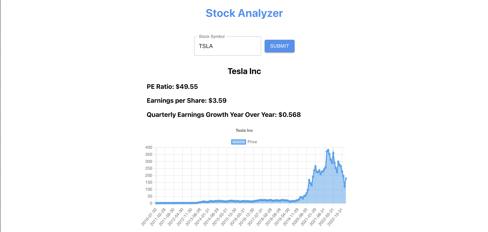
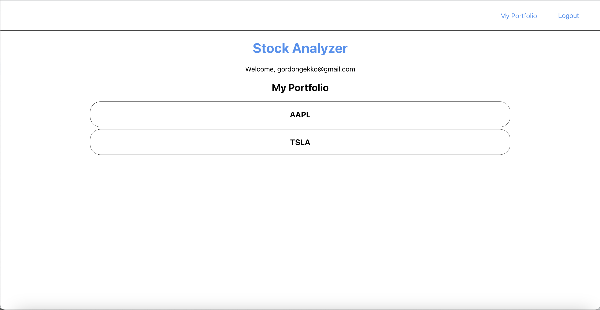

# Stock Analyzer

https://stock-client-tau.vercel.app/

## Summary

Simple web application that allows users to search for relevant stock information for investing purposes (price history, P/E ratio, etc.). Users can also sign up for an account, which enables them to save individual stocks to their portfolio. I built this because I wanted to make something that visualizes data in some way, and that saves user information in local storage. The demo email address is 'gordongekko@gmail.com' and the pasword is 'Password1', and remember that a stock symbol (i.e. 'AAPL,' 'TSLA', etc.) must be entered--NOT a stock name. Enjoy searching!

Link to server repo: https://github.com/Jamesclifford7/stock-server

Uses Alpha Vantage API for stock information: https://www.alphavantage.co/

## Scripts

`npm start` -- Runs the app in the development mode.
Open [http://localhost:3000](http://localhost:3000) to view it in your browser.

`npm test` -- Launches the test runner in the interactive watch mode.

## Screenshots

## Built With: 

React.js

TypeScript

Material UI

Styled Components

